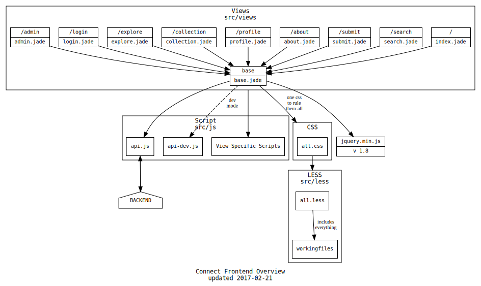

Development
===========

A quick intro on what you might want to know when starting backend or frontend development.

## Backend
The core application logic resides in the backend. We strive to keep the backend logic as simple as possible.

### Backend dependencies
 - maven version ~3
 - java sdk version ~1.8
 - neo4j version ~2.6

### Backend design

Here is an overview of the different components that make up the backend. Each box corresponds to a java package with a similar name.

 - `Connect` initializes the server modules (`se.lth.cs.connect.modules.*`) and routes (`se.lth.cs.connect.routes.*`)
 - General database queries are executed by `Database`. Queries are built using jcypher helpers.
 - Specialized database queries should be hidden by an interface, e.g. login/authetication logic is implemented in `AccountSystem`.
 - The two exceptions (`DatabaseException.java` and `RequestException.java`) are thrown by handlers and handled by a function in `Connect.java`, like a bubble-style event.
 - Event cascading is explicitly specified in the `se.lth.cs.connect.events` package and related classes. Example: `when an entry is deleted orphaned facets should also be deleted`. Not all user-initiated actions have an associated event and events should be added thoughtfully and sparingly as they increase overall systematic complexity.

### Backend tips

Here are some tips new contributors might appreciate:

 - We use a graph-database called Neo4j. The quickest way to get up to speed of what it is and how it works is to visit their website.
 - Neo4j runs a graphical interface located at
`http://localhost:7474/browser/`. This very helpful to try and prototype commands
and later to see if correct connections and data was added to the database.
 - jcypher is used for querying the database from the backend much like SQL but with different syntax. The documentation is somewhat limited but there are examples on their github wiki. You should probably look at how things are done in the connect.routes package before trying your luck at the wiki, though. Note that jcypher can't always translate a Neo4j query directly.
 - The `application.properties` file has to be updated with the correct username and password for neo4j database.

## Frontend

### Frontend dependencies
 - node js version 5, 6 or 7 (confirmed working)

### Frontend overview

Here is an overview of the different components that make up the frontend.

The structure is quite straightforward:
 - We use jade, less and js to make up the webpages. The less and js files both have a base file which they are dependent on, then each page sub-levels down to have it’s unique properties which the rest of each pages sub-levels depend on.
 - Jquery v3 is used and is imported via the base class so this is standard across all pages.
 - For styling, LESS is used. Structurally we have a working files folder which divides the pages up and then it is imported into an `all.less` file which is converted into one CSS file.
 - There are two api files: `api.js` and `api-dev.js`. The `api-dev.js` file only changes the server to which the ajax queries from `api.js` are made.

### Frontend tips
 - It can be important to run `make clean` every now and then to be sure nothing is cached and the changes implemented are what you have made. **`make clean` is run automatically when running any make command.**
 - There are a few utilities which are used across some of the pages. They can be found in `src/js/util`.
  - One example is el.js which is used to efficiently create elements. It is encouraged to use these utilities where possible to keep the coding consistent.
 - There is no need to (re)build after _modifying_ any files. Simply save the file and reload localhost website to see the changes.
 - If you add new views, then add them to `app.js`.
 - If you add new LESS files, add them to `src/less/all.less`.

