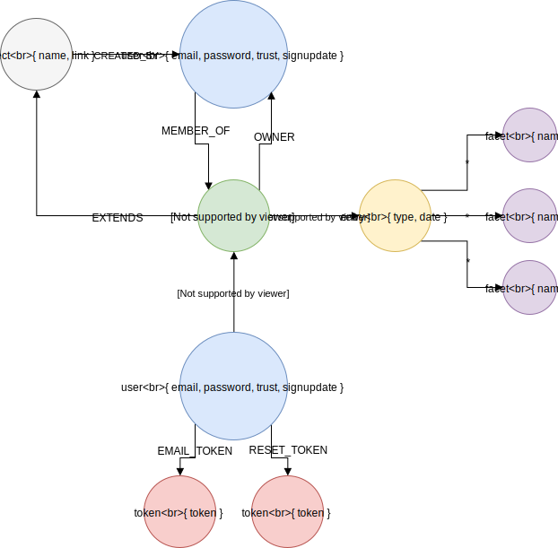

Graph
=====

## User
Accounts are stored in the neo4j graph, labeled with `user`. The account identity is
the email used to sign up (and later verify account). Passwords are hashed with
scrypt @ standard settings (N = 16384, R = 8, P = 1) and transmitted in plain-text. 
(Use HTTPS!)

## Project
A project is represented as a graph node with a `project` label. Projects are the basic
premise on which collections expand. Each project has a taxonomy.

## Collection
A collection is represented as a graph node with a `collection` label. Collections are the 
main and only way of organizing entries and are mainly identified by a combination of their
unique id and non-unique (user provided) name. Each collection has a (potentially nil) set
of taxonomy extensions of the base taxonomy (provided by the project).

## Entry
An entry is represented as a graph node with a `entry` label. Each entry has an additional
entry type label: `research` or `challenge`. Entry nodes contain the properties specific to 
the entry type. They also have relations to their entities. The relationship type is the 
taxonomy classification, e.g `:ASSESSING`.

## Entity / Facet
An entity is represented as a graph node with a `facet` label and is the free text sample
of at least one entry. The relation type between an `entry` and `facet` determines the 
classification of that entity (text sample) for that specific entry. Many entries can 
classify the same entity, even with different classifications.

## Token
A token is represented as a graph node with a `token` label. Tokens are in fact a special
type of authentication nodes. Tokens are given meaning by their relation to the user node.
At the moment only two relation types exist: `EMAIL_TOKEN` and `RESET_TOKEN` for email
verification and password reset, respectively. At the moment tokens don't expire (but they 
probably should).