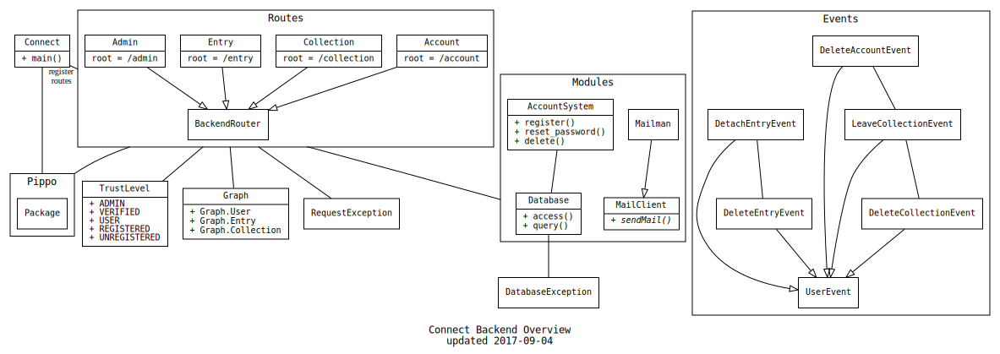

Getting Started
===============

## Overview
Here is an overview of the different components that make up the backend. Each box corresponds to a java package with a similar name.

The design is very simple:
 - The application (`Connect.java`) is the entry point and registers routers from the `connect.routes` package.
 - Each router defines endpoints (e.g. `GET /login`) that it can serve and pippo (our main dependency) performs the actual route lookups.
 - All endpoints located inside classes in the `connect.routes` package may use the common classes (`Graph`, `*Exception`, `TrustLevel`) from the `connect` package.
 - Many endpoints also rely on the `connect.modules` package to do account stuff (`AccountSystem.java`), perform database queries (`Database.java`) or send mail (`Mailman.java`).
 - It is a goal (that we haven't reached) to expose the API endpoints as wrappers around a program, such that program logic isn't in the route handlers.
 - An example of a work-in-progress idea is the account router (`Account.java`), which heavily uses the account system (`AccountSystem.java`).
 - The two exceptions (`DatabaseException.java` and `RequestException.java`) are thrown by handlers and handled by a function in `Connect.java`, like a bubble-style event.
 - Database access is only done through the `Database.java` class, it is also responsible for parsing any database errors and throwing a `DatabaseException` if needed.

## Workflow
 - Find issue on github. 
 - Pull latest updates from master.
 - Create a new branch with a sensible name and switch to it.
 - Implement changes in your favorite IDE, Eclipse is recommended for backend, Atom for frontend.
 - Write test case for backend changes if relevant.
 - Document changes.
 - Commit the changes with a sensible comment no longer than 50 characters.
 - Pull latest changes.
 - Push the changes and create a pull request.

## Tips for backend
 - A graph-database called Neo4j is used as our database. Quickest way to get up to speed of what it is and how it works is to visit their website. Neo4j have a graphical interface which is located at
`http://localhost:7474/browser/` when it's started. This can be helpful in the beginning to try commands
and later to see if correct connections and data was added to the database.
 - jcypher is used for querying the database from the backend much like SQL but with different syntax.
There are somewhat limited documentation of jcypher but there are some examples on their github wiki.
Easiest is probably to look at how things are done in the connect.routes package. Note that jcypher can't
always translate a Neo4j query directly. But everything that can be achieved by Neo4j querying can be achieved
in someway with jcypher.  
 - The application.properties file has to be configurated with the right settings in order to run the database and other applications.

### Eclipse
To use Eclipse, simply import the backend files as a github repository. We recommend using a maven plugin to facilitate running the server. 
